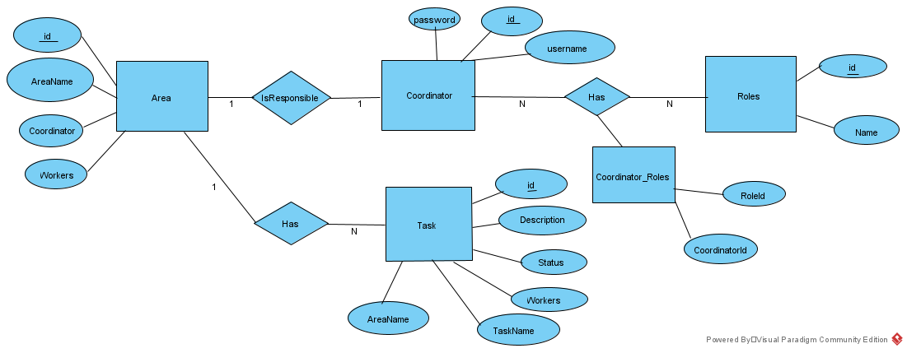
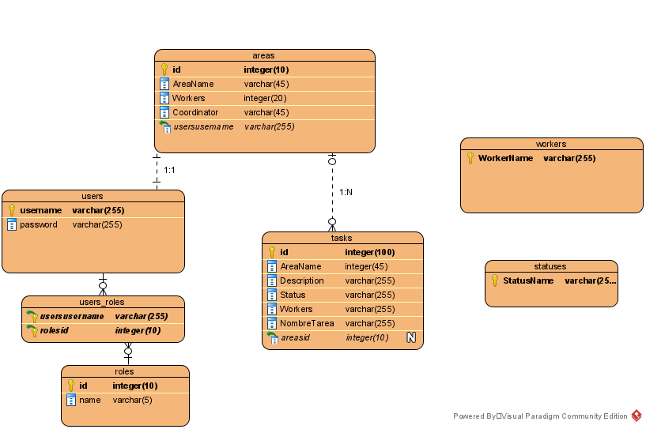
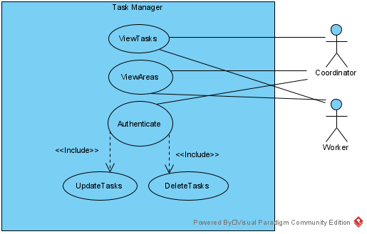
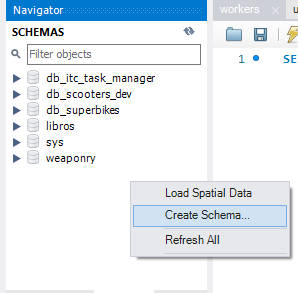
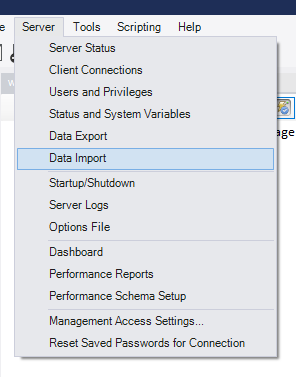
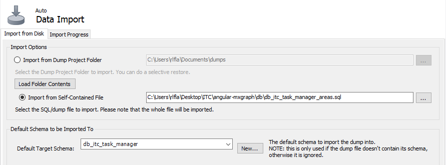
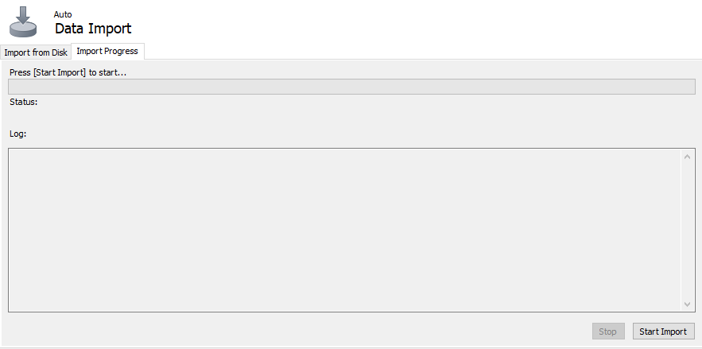

## Table of Contents
1. [General Info](#general-info)
2. [Diagrams](#diagrams)
3. [User requirements](#user-requirements)
4. [Use Cases](#use-cases)
5. [Interface](#interface)
6. [Technologies](#technologies)
7. [Installation](#installation)


# Task Manager
## General Info

This task manager is a school project with the intention of aiding to manage all the tasks found on different areas of ITC.
<p></p>

***

## Diagrams

</img>
ER diagram for the Task Manager
</img>
<p>Relational diagram for the Task Manager</p>
For an in-depth explanation (in spanish) on the data model please refer to the document found at: 
<p>https://github.com/JoelLF/Task-Manager/blob/master/docs/data_explanation.pdf</p>

***

## User Requirements

For user requirements please refer to the document found at: 
<p>https://github.com/JoelLF/Task-Manager/blob/master/docs/user_requirements.pdf</p>

***

## Use Cases

</img>
<p>Use cases diagram for the Task Manager</p>

***

## Interface
### Initial design

You can view a mockup for the interface of the Task Manager at: 
<p>https://www.fluidui.com/editor/live/preview/cF9OYlRJV1J4YlEwYWg5Y3hTTHZCcGVTTkdNNlRTT2s0Rg==</p>

### Usability

For an in-depth explanation (in spanish) on the Task Manager's usability please refer to the document found at: 
<p>https://github.com/JoelLF/Task-Manager/blob/master/docs/usability.pdf</p>

## Technologies

Frontend:
* [Angular](https://angular.io/): Version 9.0.7
* [Bootstrap](https://getbootstrap.com/)
***
Backend:
* [NodeJS](https://nodejs.org/es/): Version 13.11.0
* [Sequelize ORM](https://sequelize.org/): v6
* [MySQL](https://www.mysql.com/): Version 8.0.21

## Installation
Using the command-line install:

<li>npm
</li>
  
```bash
npm install npm@latest -g
```
<li>Angular CLI
</li>

```bash
npm install @angular/cli -g
```

Now install MySQL Workbench from:
https://dev.mysql.com/downloads/workbench/

Once MySQL Workbench is set up import the tables found on the db folder:

<li> Create a new schema named "db_itc_task_manager"
</li>
</img>

<li> Start importing each table by selecting "Server" > "Data Import" on the top menu
</li>
</img>

<li> Select "Import from Self-Contained File" and click on the [...] button to enter the route were you stored the db folder, then pick one table from the folder
</li>
<li> Click on the dropdown for "Target Schema" and select "db_itc_task_manager"
</li>
</img>

<li> Click on "Import progress" and then "Start Import"
</li>
</img>

<li> Once the import has finished repeat the process with the remaining tables
</li>

***

Once everything has been set up:

<li>Using the command-line, navigate to the directory were you want to download the project and clone this repository
</li>

```bash
git clone https://github.com/JoelLF/Task-Manager
```

<li>Using the command-line navigate towards the backend and frontend folder respectively and install the required modules
</li>

```bash
npm install
```

<ul> Create the following files at backend/config

<li> auth.config.js
</li>

<li>With the help of a text editor write the following:

<pre> module.exports = {
  secret: "type here anything you like to use as unique key"
};
</pre>
</li>
<li> db.config.js
</li>

<li>With the help of a text editor write the following:
</li>  
  <pre> module.exports = {
  HOST: "type your MySQL host here (default is localhost)",
  USER: "type your MySQL user here",
  PASSWORD: "type your MySQL password here",
  DB: "db_itc_task_manager",
  dialect: "mysql",
  pool: {
    max: 5,
    min: 0,
    acquire: 30000,
    idle: 10000
  }
};</pre>
</ul>


## Usage

To start using this application:

<li>To start the backend server, use the command-line and navigate towards the backend folder, then use the command:
</li>

```bash
node server
```

<li>To start the frontend server, use the command-line and navigate towards the backend folder, then use the command:
</li>

```bash
ng serve --port 8081
```

You can now start using the application by accessing http://localhost:8081/ on your browser
(note that all demo users from the imported table have '1234' as their passwords for login)

